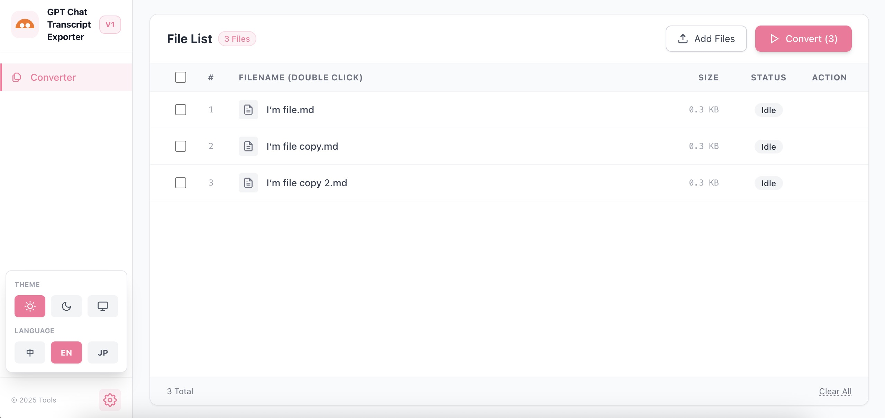

## English

# GPT Chat Transcript Exporter

A lightweight, local-first utility for transforming GPT chat transcripts into clean, readable text for reflection and archival use.

## What it does

- Converts GPT chat transcripts into plain text or Markdown
- Removes UI noise and platform-specific formatting
- Keeps the conversation structure intact for reading or archiving

## Background

This tool focuses on restoring GPT chat transcripts exported via plugins into a readable format that closely matches the original GPT interface.
It exists as a practical alternative when the official export process is slow, unreliable, or unsuitable for segmented workflows.

## Scope

This tool is currently designed and tested specifically for GPT chat transcripts.  
Other LLM platforms have not been tested.

## How to use

Open `index.html` locally in a modern browser.  
Paste or load a GPT chat transcript, then export the cleaned result.

## Notes

- Runs entirely in the browser
- No backend, no data upload
- Intended as a lightweight utility for personal use

---

## 日本語

# GPT Chat Transcript Exporter

GPT のチャット履歴を、振り返りや保存に適した、

読みやすいテキスト形式へ整理するためのローカル実行型軽量ツールです。

## 機能

- GPT のチャット履歴をプレーンテキストまたは Markdown に変換
- UI ノイズやプラットフォーム固有の形式を除去
- 会話構造を保ったまま整理・保存が可能

## 背景
本ツールは、ブラウザプラグイン経由でエクスポートされた  
GPT のチャット履歴を、元の GPT インターフェースに近い形で  
読みやすく復元することを目的としています。

公式のエクスポート手順が遅い、安定しない、  
またはウィンドウ単位・分割での利用に適さない場合の  
実用的な代替手段として作成されています。

## 対応範囲

本ツールは現在、GPT のチャット履歴のみを対象として  
設計および動作確認を行っています。  
他の LLM プラットフォームについては検証していません。

## 使い方

`index.html` をそのままブラウザで開いてください。  
GPT のチャット履歴を貼り付け、または読み込むことで  
整理されたテキストを出力できます。

## 補足

- ブラウザ上で完結して動作します
- バックエンドやデータ送信はありません
- 個人利用向けの軽量ツールです

---

## 中文

# GPT Chat Transcript Exporter

一个本地运行的轻量级工具，用于将 GPT 聊天记录整理为干净、可读、便于反思的文本形式。

## 功能说明

- 将 GPT 聊天记录转换为纯文本或 Markdown
- 去除界面噪音与平台相关的格式
- 保留对话的基本结构，便于阅读或存档

## 背景说明
该工具主要用于将通过浏览器插件导出的 GPT 聊天记录，  
还原为接近 GPT 原始界面的可读格式。

它的存在是为了在官方导出流程较慢、不稳定，  
或不适合按窗口、分段导出的情况下，提供一种更实用的替代方式。

## 使用范围

该工具目前仅针对 GPT 的聊天记录进行设计和测试。  
尚未对其他 LLM 平台进行兼容性验证。

## 使用方式

直接在现代浏览器中打开 `index.html`。  
粘贴或加载 GPT 聊天记录后，即可导出整理后的文本。

## 说明

- 完全在浏览器中运行
- 无后端、不上传数据
- 作为个人使用的轻量级工具

---

## License

MIT License

